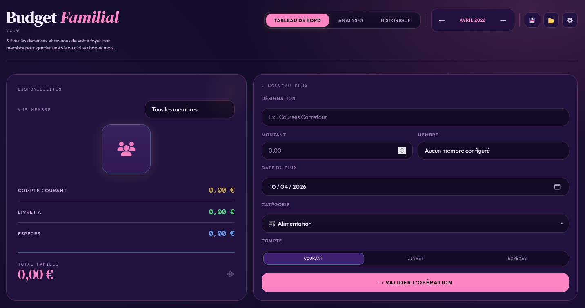

# 💰 Budget Familial · EkHo

> Application de suivi budgétaire familial — 100 % frontend, zéro dépendance, zéro serveur.



**🌐 Live demo → [ekho.re/html/saas/budget.html](https://ekho.re/html/saas/budget.html)**

---

## ✨ Fonctionnalités

| Catégorie                   | Détails                                                                      |
| --------------------------- | ---------------------------------------------------------------------------- |
| 👥 **Multi-membres**        | Gérez plusieurs membres avec solde initial par compte et icône personnalisée |
| 💸 **Transactions**         | Revenus, dépenses et **transferts entre membres**                            |
| 🏷️ **Catégories**           | Catégories colorées avec icônes emoji                                        |
| 📊 **Graphiques**           | Visualisation des dépenses par mois avec barres interactives                 |
| 📅 **Navigation mensuelle** | Filtrage par mois, vue par membre ou globale                                 |
| 🎨 **5 thèmes**             | Dark · Light · Kawaii · Cyberpunk · Retrowave                                |
| 💾 **Persistance locale**   | Données sauvegardées dans le `localStorage` du navigateur                    |
| 📤 **Export / Import**      | Sauvegarde et restauration des données en JSON                               |
| 📱 **Responsive**           | Adapté mobile, tablette et desktop                                           |

---

## 🖼️ Aperçu


---

## 🚀 Utilisation

Aucune installation requise. Ouvrez simplement le fichier dans votre navigateur :

```bash
# Cloner le repo
git clone https://github.com/BullShieldTeck/budget.git

# Ouvrir dans le navigateur
open index.html
```

Ou accédez directement à la version en ligne :  
👉 **[https://ekho.re/html/saas/budget.html](https://ekho.re/html/saas/budget.html)**

---

## 🔗 Liens EkHo

- 🌐 Site: [https://ekho.re](https://ekho.re)
- ▶️ Démo en ligne: [https://ekho.re/html/saas/budget.html](https://ekho.re/html/saas/budget.html)
- 🐙 GitHub (profil): [https://github.com/BullShieldTeck](https://github.com/BullShieldTeck)
- 📦 GitHub (repo): [https://github.com/BullShieldTeck/budget](https://github.com/BullShieldTeck/budget)
- 💬 WhatsApp: [https://wa.me/message/G5VZMORW65IQI1](https://wa.me/message/G5VZMORW65IQI1)
- ✈️ Telegram: [https://t.me/EkHo974?direct](https://t.me/EkHo974?direct)
- 📧 Email: [contact@ekho.re](mailto:contact@ekho.re)

---

## 📁 Structure

```
budget/
├── index.html              # Application complète (HTML + CSS + JS)
├── budget_ekho_*.json      # Exemples de fichiers de données exportés
└── README.md
```

---

## 🛠️ Technologies

- **HTML5 / CSS3 / JavaScript vanilla** — aucun framework, aucune dépendance
- **Google Fonts** — DM Serif Display · DM Mono · Outfit
- **Font Awesome 6** — icônes
- **localStorage** — persistance côté client

---

## 🎨 Thèmes disponibles

| Nom          | Style                                     |
| ------------ | ----------------------------------------- |
| 🌑 Dark      | Fond noir charbon, accents dorés (défaut) |
| ☀️ Light     | Fond crème, tons chauds                   |
| 🌸 Kawaii    | Pastels roses et mauves                   |
| ⚡ Cyberpunk | Néons jaune et violet sur fond sombre     |
| 🌆 Retrowave | Dégradés violets et roses type années 80  |

---

## 💡 Démarrage rapide

1. **Ajouter des membres** — Ouvrez les ⚙️ Paramètres, section _Gestion des membres_
2. **Saisir des transactions** — Utilisez le panneau _Nouvelle transaction_ (revenus, dépenses, transferts)
3. **Naviguer par mois** — Utilisez les flèches `‹ ›` pour changer de période
4. **Filtrer par membre** — Cliquez sur la vue membre en haut
5. **Exporter vos données** — Bouton 📤 en haut à droite pour sauvegarder en JSON

---

## 📜 Licence

Projet personnel open source — libre d'utilisation et de modification.

---

<div align="center">
  Fait avec ❤️ par <strong>EkHo</strong> · <a href="https://ekho.re">ekho.re</a>
</div>
